## Analysis
### Problem identification
With the internet constantly growing, and more and more people relying on it, the demand for websites is constantly increasing - it is now expected for businesses to have their own webpage that people can easily access. They can range in style from business portfolios, to online stores, to games. However, a lot of people may find it difficult to create a website for themselves or their organisation, and the task of manually programming it can seem very daunting. The main aim of this project is to develop a website that allows clients to produce their own website via a simple user interface, which alleviates the technical intricacies of HTML, CSS and JavaScript. Clients will be able to select from a variety of styles and themes - or create their own - upload media such as images and videos, and then interact with a drag and drop interface to organise a webpage. Each website they create would have it’s own page dedicated to it, with options to customise the styles of the site, ability to create, organise, and link together pages of the website, preview the website in a variety of display sizes, and of course add pre-made elements and edit the parameters of the elements in the site. The requirements for a client to be able to use it would also be low, due to the entire application being contained within its own website, meaning that the client would only need a web browser and internet connection. This means the client doesn't need to install software onto their computer, nor do they need to worry about software updates.

#### Stakeholders
The clients for this software would be businesses or individuals who require a website but do not have the technical competency or time to build one themselves.

| Stakeholder | Role |Interaction |
|--|--|--|
| | | |
| | | |


#### Why it is suited to a computational approach
This problem lends itself to acomputational approach due to the fact that websites are inherently computational. The solution will be run from a server that hosts a website, meaning it will need a computer to use. There is no alternative that would not require a computer to be able to create a website, as at one point you will need to write and host the code that you have produced. This program would simply act as a bridge between the client and the code.

#### Computational methods that the solution lends itself to:
##### Problem recognition
##### Problem decomposition
The problem can be broken down into smaller tasks that need to be run for the program can be used effectively.
- Creating an account system, and a database to store the user's data.
> The account system would allow for many different users to access the server and edit their sites. The data would be stored in a server-side SQL database. The sites would be stored separately on the server.
- Creating a menu system for the user to navigate so that they can access different sites.

- Storing a list of template elements that the user can preview and use in their site.
> I would need to decide on how to store the template elements, how to display them to the user, and then how to implement them into a user's site whilst still allowing them to edit them.
- Creating a simple drag and drop interface that is easy to use and understand.
> This would probably be based off of the grid based positioning system that many existing website builders use, or the constraint system that applications such as android studio use, however that may not work with how HTML is created.
- Creating an effective way of storing the users' sites on the server.
> They would either be stored in HTM, CSS, and JS files, which would remove the need to convert them, or they could be stored all in XML files, which would make accessing the files easier: the program could convert the XML elements into HTML, CSS, and JS to allow it to be showed. This would allow for the storage of more information about the site and elements, and would mean it could all be in one file, including all the separate pages. The
- Converting the user's site into runnable HTML, CSS and JavaScript, so that they can download and use it.
> There would need to be a way for JS to do it so that the user can edit the site in the editor, and a way for the server (written in python) to do it as well

##### Divide and conquer
These smaller steps are all doable on their own, and combining them together mould make a divide and conquer approach. The advantage of it being coded in a modular way such as this is that each part can be tested and built on its own, without relying on other parts of the project.

##### Abstraction
The program uses abstraction as it removes the complex process of having to program code by transferring it into a more simple, graphical interface. This removes the need of the client to have knowledge and experience in programming and therefore opening the market to a much larger audience.

### Research
#### Existing solution - Squarespace
In their template list, they give the option to preview the website, with all of its functionality in a separate page. They allow you to view it in different sizes as well.


When first starting to edit the site, squarespace offer an assistant with some basic first steps to creating the website, which makes it easier for the client to be able to understand how the editor works and how to effectively use it.


Their design options include the styles, browser icon, 404 page, and custom css options. They can change the fonts, color scheme, global animations, spacing, and default styles for certain widgets.


Their editor works in the conventional way of a grid based system, where you can place elements anywhere on the grid. It will then assign the item the style property ```grid-area:row-start/col-start/row-end/col-end```, or ```grid-area:y/x/height/width``` to define the position of the element. They have different attributes for different screen sizes, and you can edit both different styles by switching between laptop mode and phone mode.


The website is split into sections, where each section contains a content wrapper with the grid positioning system inside.


By selecting text, you get a popup that displays the text formatting options. Whenever you click on an element, you get a different popup that displays the design options for said element


##### Parts I can apply to my project
My solution will have the option to preview and use templates in a similar way to how Squarespace does it, along with their grid positioning system, which is, for lack of a better phrase, an "industry standard." There will also be a similar formatting option setup, but in will be docked on the right hand side with all of the formatting in the same place.

#### Existing solution - Zyro
Zyro also use an assistant to help the user understand how to use their editor.


Zyro have two ways of positioning objects; one of them is very similar to the way squarespace do it, with a grid positioning system, and the second is something they call smart layout. It instead uses only columns to position, and the elements can be moved up and down said columns freely and snap to other elements, like how many editors like photoshop might do. You can toggle the snapping to other elements in section settings


Their image resizing system is nice. It makes use of the ```object-fit:cover``` property in the style of the image, and just changing the width and height attributes when being dragged, as explained later


Something else zyro does is have all of their style attributes defined in one class, which rely on variables such as ```--grid-row```,```--m-grid-column```, and```--element-width``` that are defined in element.style (the style attribute of the HTML object), which have presumably been put their by JavaScript.

This is the CSS class with all of the variable references:


This is the HTML style attribute with all of the variable declarations in it:


When moving elements around the layout, Zyro adds four variables to the element, top, left, width, and height, which they use to render the positioning of the element while you are moving it. When you release the element, these values are removed. This positioning would probably be done in JavaScript by taking the position of the cursor when you clicked on the element, getting the position of the element when you click on it, and then offsetting the position of the element by the amount you remove the cursor. Then, when you release the cursor, it runs the code to calculate the new grid positioning of the element. They also have a max width for desktop, where the element cannot be moved further.


#### Initial concept consider this research
My solution will be a web-based, multi user program where the user uses a grid-based, drag and drop system using pre-defined template elements that they can then customise. There will be a tutorial for when you first create an account to help new users understand the system. The user will be able to customise styles for their site, organise pages, access a library of predefined templates for widgets such as text, buttons, or links, and have control over the styling of each individual element in their pages. The aim is to have an easy learning curve and a low bar of entry for understanding so that anybody can use it.

The main limitation it would have would be that, as it is a server side application, the user will always need an active internet connection to access it, and, if the server goes down, there will be no way of using the program.

#### Meeting with the stakeholders
I should probably contact the "stakeholders" at this point as I'm developing ideas on how the website builder would function.

### Hardware and Software Requirements

#### Hardware Requirements
A computer capable of accessing the internet.

#### Software Requirements
A JavaScript-compatible web browser and an active internet connection.

### Stakeholder requirements

### Success Criteria

 - Login system
 - ability to view password with the all seeing eye
 - Sign up fields to be Name, email, username, and two passwords to make sure they get it correct
 - fully functional error checking on all fields as followed
> All fields must not be empty
Name can have spaces and non alphanumeric characters, must be longer than 2
Email must be in an email format
Username cannot have non alphanumeric characters, must be longer than 2
Password must be longer than 8
Repeat password must be identical to Password
Email cannot already be in the database
Username cannot already be in the database

 - The homepage, when there are no sites, displays a prompt to create a new site
 - The homepage, when the user has created sites, lists all of them along with a "create new site" button
 - Ability to (export and) import sites in a zip file so that you can transfer them between sites. This is different to downloading a useable copy of the website. Export function may not be necessary as it is given in the site settings.
 - When creating a site, you get the following options
> Website Name: at least 4 chars, and any illegal characters are converted into dashes. The user is given a preview of what their site name will look like when it doesn't match the criteria.
Description: optional
Whether the site is public or private: determines who has access to the site URLs

 - You then proceed through options that allow you to change the default styling properties of the site.
> These will be the options for color palettes, primary and secondary fonts, and button settings.

- Sites can be accessed by the URL: `/<username>/<sitename>`, and, if public, can be viewed (but not edited) by anyone from this URL. If private, other users will be told this and redirected home.
- The owner of a site can assign other users the ability to edit public or private sites, but you can't have two people editing at the same time. (This is because it would be more complicated to program)
- The site will have a config file, where it stores all of its global variables - mostly style choices - which have been selected when creating the site. These can also be edited at any time in the site homepage.
> These variables include primary, secondary, accent and grey colors, primary and secondary fonts, button styling choices, and animation types.

- The site page (`/<username>/<sitename>`) can be programmatically assigned due to the python backend: it can take both parameters, search for them in the database, make sure that the current user has permissions, and display the appropriate site.
- On the site page, the user will get a preview of the website, along with customizability options for the website: the ability to edit the site, reorganise the site structure (which pages go where), edit site settings (such as default colors), and export the site.
- when editing the site, the organisation will look like this
> a navigation bar on the left that contains the options: "website pages" where you can navigate to a different page, "add section" where you can add another template section to the current page, "website styles" where you can change global settings such as fonts and colors, and "add element" where you can drag and drop individual elements into the canvas to edit.
a central canvas where the actual web page can be previewed
a popup modal for the centre which appears when you need to select a section or element to add to the page
a styling section on the right hand side where you can edit all of the styling properties for a selected element


- The central canvas will import the raw html and css files from the server, and it will rely on data tags in the html element to understand what does what and how to edit it.
- Whenever a widget is selected, a box will be drawn around it, with the ability to resize it. the style menu on the right will also populate with style options for the selected element that can be changed in real time, and can be previewed when hovered over, so that the user can easily understand what certain buttons will do.
- Whenever a widget is selected and held, an outline of the parent section's grid system is previewed, and the element can be moved around. It does this by tracking the position of the cursor and relating that to the start position of the cursor on the widget (the anchor point) to render it in the correct place using left right top bottom css tags. When released, the widget will snap into the nearest grid space to where it was released. A similar thing happens when you select and hold one of the resize elements on the outline, where it tracks the cursor and then snaps into the closest grid space to resize it.
- The position parameters, that are changed as described above, are separate for the desktop view and mobile view of the web page. Changing the position when the page is in desktop mode will not affect the position in mobile mode, and vice versa.
- When a widget is right clicked, it will show useful commands such as copy, paste, delete, duplicate, etc.
>

- To export the site, the user will have two options, that will be clearly defined in the UI
- They can download the site, which will download a zip file containing all the required HTML, CSS, and JavaScript code, so that they can unpack the archive and run the webpage by simply opening the HTML file.
- They can export the site, which will download a different zip file that contains all of the internal files that Kraken uses to run the editor for the page. This means that the user can download backups and send their websites to other people.
>

## Design
### User Interface Design


This is the main "template" that all of the pages are built on. The main content will be displayed inside. Defining this in a separate file beforehand (`/templates/base.html`) means that the website has a more unified feel and it allows the user to always be able to go home and access the navigation menu. Defining it in a separate file also removes redundancy as the code for it only appears once.

Home Button
>The Home button, placed in the top left hand corner so that it is easy to find and matches how other websites do it; it meets the standardised expectations that the client has.

Hamburger
>The navigation menu has been hidden behind a hamburger at the bottom of the sidebar. This is because, due to the navbar being docked on the side, having lots of links on it would look messy and be hard to read. Therefore, you can click the hamburger and a modal will appear with all of those links. Clicking the hamburger again, or anywhere else on the screen, will close the modal. The reason why the navbar is on the side of the screen is not only a design choice, but it means that the website builder has more space vertically.

Main Content
>This area is where most of the interactive elements will be. These can be seen in subsequent diagrams below.

#### Login and Signup Pages


This shows the layout of the login and signup pages. Built inside the main template, it contains:
- The header to tell the user what they are doing
- The buttons to toggle between login and sign up
- A warning message area for incorrect credentials or invalid input
- The form area which is populated by inputs with labels next to them
- The submit button at the bottom

#### Homepage


This shows the layout of the homepage once you've logged in, if you already have created a website. Built inside the main template, it contains:
- The header, saying "Welcome, <username>" so that they know that it is the homepage
- A grid of all of their current sites.
> The grid will change the number of columns programatically, based on the display size. It contains square divs, each showing the title of the website, an icon informing the user as to whether it is public or private, and is colored based on the primary color of said website. The text color redefines itself based on what the background color of the div is, to make sure it is easy to read

- A create new site button with the same dimensions as the site divs, at the end of the grid layout.

#### Site Home


This shows the layout of the site page for the owner (when they visit `/<username>/<sitename>`). Built inside the main template, it contains:
- The header, displaying the name of the site so that the user knows which site they are editing.
- Navigation options, a list of links that allow the user to navigate the menu system
> The links include:
Home, which will display a preview of the website in the content window
Edit site, which links to the editor
Site preferences, site styles and site settings, which all open setting menus in the content window.

- The main content window, which will display content based on what is selected in the navigation options. By default, it will display a preview of the website, but can also display setting menus as well.

#### Site Edit


This shows the layout of the site editor. Built inside the main template, it contains:
- The navigation bar, docked to the left, which contains icons for different links. When hovered, these icons will display a label for what they will open.
> Some of these options will be: Add section, add element, website pages, website styles, and website settings

- The display options bar, docked to the top, will contain some settings for how the editor is shown, and are put here so that the user has easy access to them.
> These will include things like display size, switching between desktop, tablet, and mobile aspect ratios, previewing the website, and other settings.

- The selected element options, docked to the top, will contain quick-access site settings until an element is selected in the content window. When an element is selected, it will display style settings for that element.
>  

- The content window will display the site so that the user can edit. There is more information on the mechanics of this section at other parts of the report.

### Usability
The usability features that I have considered make sure that the program is easy to use for as many users as possible, including those with accessibility issues. All of the buttons in the designs are large and easy to notice. All times when font selection or styling is used, previews for what the font looks like are shown so that the user can clearly see what it will look like. This functionality is also borrowed by other styling and positioning functions in the editor. All colors will be checked to make sure they have a large enough contrast ratio, so that people with color deficiencies will see an adequate contrast between the text and the background. This includes elements such as color pickers, where the label text that shows the hex code will change color depending on the background, to make sure that it is still readable. [WebAIM](https://webaim.org/resources/contrastchecker/), a website used to improve accessibility on the internet, will be used to make sure that their is enough contrast in the text. Furthermore, links in text will also be checked to make sure that they have at least a 3:1 contrast ratio with the surrounding text, so that they are visible enough. Quoted from [WebAIM](https://webaim.org/intro/#types),
> "Often, these [accessibility features] promote overall usability, beyond people with disabilities. Everyone benefits from helpful illustrations, logically-organized content and intuitive navigation. Similarly, while users with disabilities need captions and transcripts, they can be helpful to anyone who uses multimedia in silent or noisy environments."

The basic accessibility requirements that are suggested, and that could apply to this project, include:

|Requirement|Explanation|
|:---:|---:|
|Provide equivalent alternative text|Provides text for non-text elements. It is especially helpful for people who are blind and rely on a screen reader to have the content of the website read to them.|
|Create logical document structure|Headings, lists, and other structural elements provide meaning and structure to web pages. They can also facilitate keyboard navigation within the page.|
|Ensure users can complete and submit all forms|Every form element (text field, checkbox, dropdown list, etc.) needs a programmatically-associated label. There may be some text that is not focused by tabbing through the form. Users must be able to submit the form.|
|Write links that make sense out of context|Every link should make sense when read by itself. Screen reader users may choose to read only the links on a web page.|
|Do not rely on color alone to convey meaning|Color can enhance comprehension but cannot alone convey meaning. That information may not be available to a person who is color blind and will be unavailable to screen reader users.|
|Make sure content is clearly written and easy to read|Write clearly, use clear fonts, and use headings and lists logically.|
|Design to standards|Valid and conventional HTML & CSS promote accessibility by making code more flexible and robust. It also means that screen readers can correctly interpret some elements of the website.|

ARIA (Accessible Rich Internet Applications) attributes will be used throughout the website to allow screen readers to navigate the website. These attributes can be used by assistive technologies, such as screen readers, to provide a more detailed and customized experience for users. It is particularly useful for improving the accessibility of dynamic content and advanced user interface controls, such as those that are used in rich internet applications.

To make it easier for users to navigate, and also to reduce cognitive load on users, the site will have a deliberatley simple structure, with many features being hidden behind modals or popup boxes. Elements such as the home button will be placed in conventional positions to make it easier for the user to find.

### Stakeholder input :D  

### Website structure and backend
#### Flask
I have decided to use the flask python library as the backend for this website, as I have prior experience in using it and it suits my project. It is well documented online, relatively lightweight, and easy to use. Although it doesn't include as many built-in features as other libraries (such as Django), there are plenty of other python libraries, such as `flask-login` and `flask-sqlalchemy` that can add in all of the functionality that is missing from the framework.

#### Jinja
I have decided to use the Jinja2 template syntax for the storage of the HTML files, as it has in-built functionality with flask, via use of the `flask.render_template()` function. All of the HTML files used for the website will be stored in the `templates/` folder in the server directory.

Jinja is a template system built for Python and Flask (other frameworks have different template systems). It makes use of templates to reduce duplicated code and make it easier to develop. It means that you can use logic operations in the template file, with functionality for `if`, `while`, `for`, and variable declaration and usage.

An example system of a Jinja file structure might look like:

##### base.html
```jinja
<!DOCTYPE html>
<html>
  <head>
    <title>Jinja Example</title>
  </head>
  <body>

    
    

  </body>
</html>
```
##### itemlist.html
```jinja




<h1>A list of items</h1>
<ul>

  <li>{{ item }}</li>



```
##### main.py
```python
from flask import Flask, render_template

app = Flask(__name__)

@app.route('/')
def index():
    items = ["apple", "banana", "cherry"]
    return render_template("itemlist.html", items=items)
```

In `base.html`, you can see the ``, which states that this is a control statement. In this case, it defines that the `block` referenced as `content` is to be inserted here. You can have multiple blocks with different names so that a child file can add multiple blocks of content in different places throughout the template.

In `itemlist.html`, you can see that it `extends base.html`, meaning that it is using `base.html` as a template, and looking at that file to find where to insert the code inside `block content`. It also makes use of a `for` loop to programatically add list items to the website, based on the list `items`, that is imported in `main.py`, in the `render_template()` command. The `{{ ... }}` indicates that the contents are a Jinja expression.

#### HTML, CSS and JavaScript
As with a lot of websites, I will be building it using HTML (via Jinja's template generation), CSS and JavaScript. This is because they are all web standards, and are therefore supported by all modern web browsers and devices (although devices is not much of an issue as it will run better on a high resolution landscape display). It will allow for SEO compatibility, it is open source (and therefore free), and it is highly versatile and can accomplish a lot. I am also very competent with HTML, CSS & JavaScript, and have a lot of experience programming with them.

### Data storage
There will be two different methods of storing information for the website:
- The multi-user system, including the information about the users' sites, will be stored in an SQL database using the `flask_sqlalchemy` python library, so that it can easily be integrated into the flask backend.
- The server will store the users' sites, including the HTML, CSS and JavaScript code.

#### SQL database storage
I have decided to use SQL to store the multi-user information as I have previous experience using SQL, and therefore it will be easy for me to setup and use. It is also useful due to its entity-relationship capability, meaning it will be well suited for storing information about users' sites. It also has a python library that integrates it to the current backend library that I am using, flask. This means that there will be less work for me to do, as most of the functionality that I will need is already built in and tested.

This is the planned entity relationship diagram for the SQL database. It contains two entities, USER and SITE, that are connected with a one-to-many relationship with user_id being the foreign key in SITE.

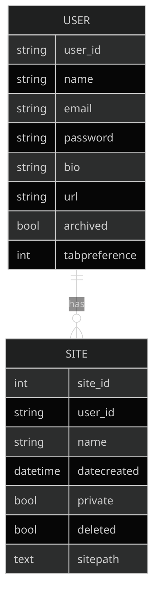

To incorporate a multi-user editing system for certain sites, the entity relationship diagram for the database will look like this. However, this may not be implemented due to time constraints.

It contains three entities, USER, SITE and LINK. It is similar to the previous one, with a linking table added between the two original entities, allowing for multiple users to be able to edit multiple sites. Each LINK also contains information about the USER's permissions for the SITE.

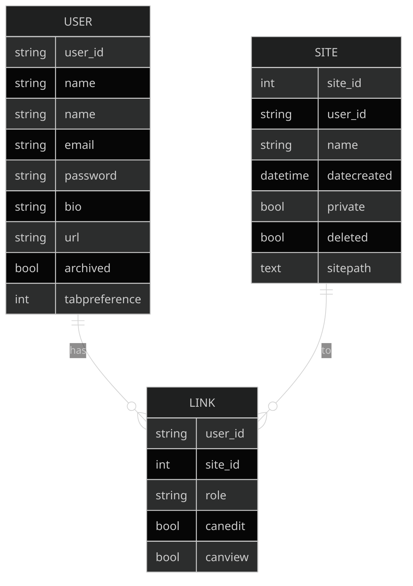

#### Server-side file storage
For storage of the actual user website files, I have chosen server-side storage as it can't be easily stored in SQL. It is all stored server-side so that the user can access their files from any computer with an internet connection. The way I intend to store the site information is shown below.

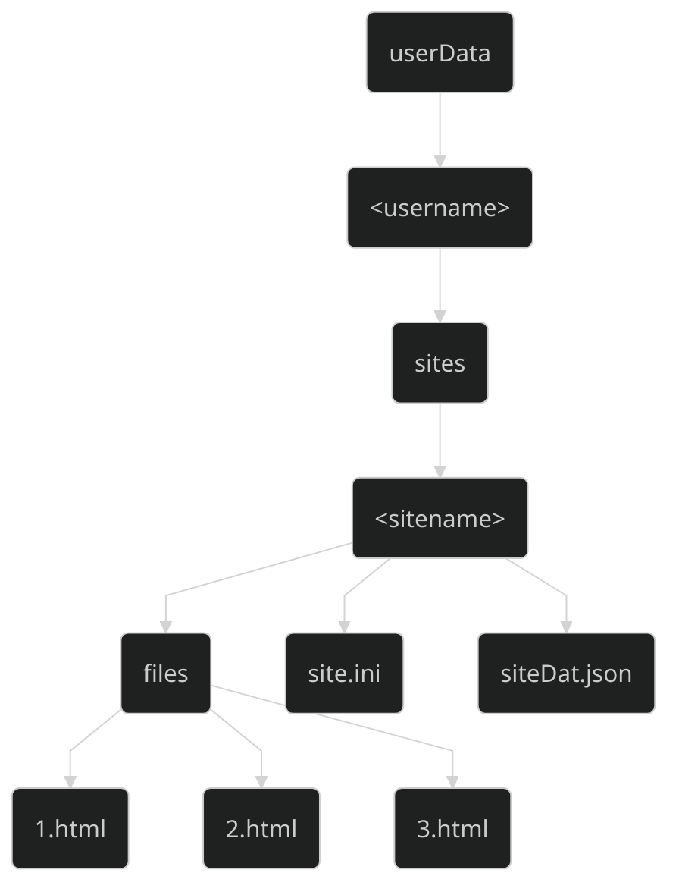

The `username` and `sitename` folders will be named by the primary keys of the data in the SQL database to avoid any duplicate folder names.

The `files` folder will contain all of the HTML files, named sequentially, and any custom CSS and JavaScript files that the user has added.

The `siteDat.json` file will contain all the information about the site file structure, referencing which page requires which HTML file in the `files` folder, and which CSS and JavaScript code blocks need to be imported.
> The server will have a store of CSS and JavaScript that will format every template element and section.

The `site.ini` config file will contain all of the information about the site settings, theming and preferences.

### Algorithms
The main parts of this solution are using a SQL database to store information about the multi-user system, the UI design and interactivity, and the actual drag-and-drop editor, with the drag-and-drop editor being the most complex. The main things that the drag-and-drop editor should be able to do are:
- Display a resize box around a clicked element.
- Resize an element when its resize box is dragged.
- Preview a live display of a dragged element (moving with the cursor), along with the resize box rendering where the element will land when dropped (snapping to the grid).
- Display a set of styling features in the right hand menu for a selected element or section.
- Display a set of options next to a selected element.
- Display a text editor for a selected element with editable text.
- Display a set of options in the bottom corner of a selected section.
- Preview a live display of a dragged section, and renumber the sections into their new positions when dropped.

In the JavaScript code, each element will have a set of event listeners on them, defined by data tags in the HTML elements:
- `data-kraken-resizable`
- `data-kraken-draggable`
- `data-kraken-editable-text`
- `data-kraken-editable-style`
- `data-kraken-locked`

These will define which functionalities can be used for each element.
For all of the below diagrams, if the element has the tag `data-kraken-locked`, it will only show a button next to the element/section to unlock it.

When an element is selected, depending on its function, it will be tagged with one of these attributes, so that the JavaScript can easily edit it:
- `data-kraken-selected-text`
- `data-kraken-selected-style`
- `data-kraken-selected-resize`
- `data-kraken-selected-drag`

##### Resize box
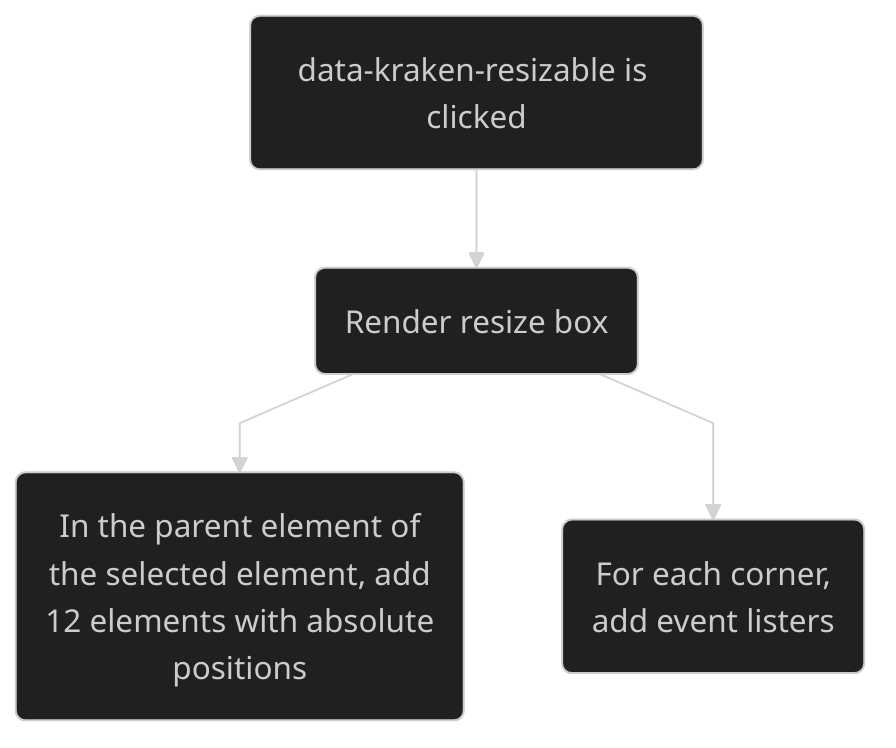
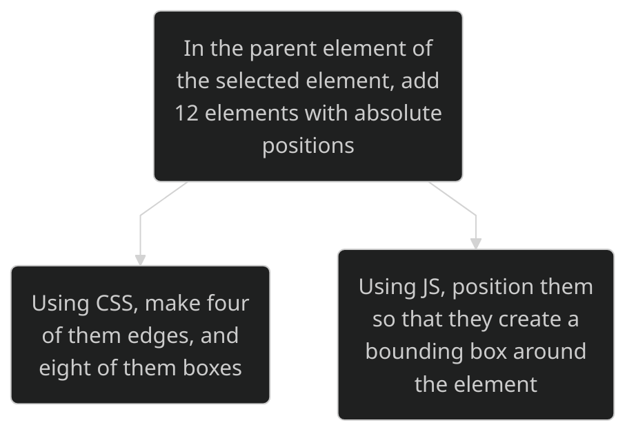
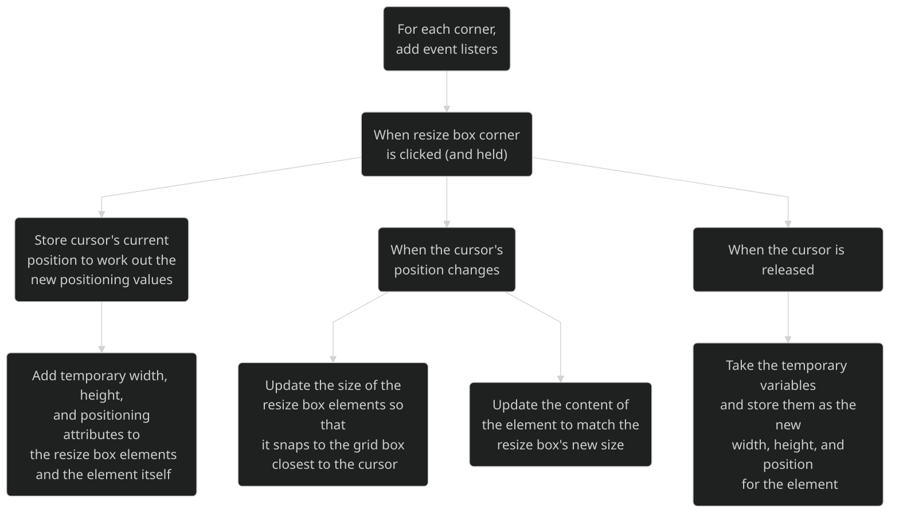

##### Dragging and dropping elements
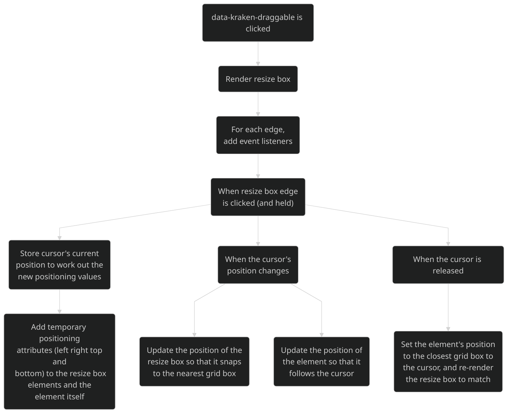

##### Dragging and dropping sections
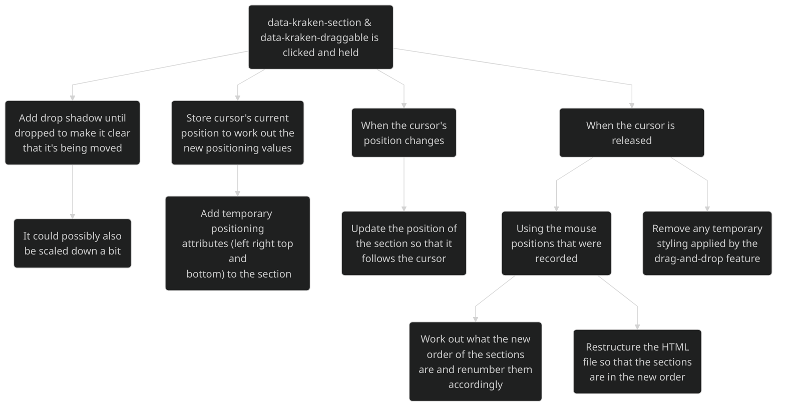

##### Displaying element and section options
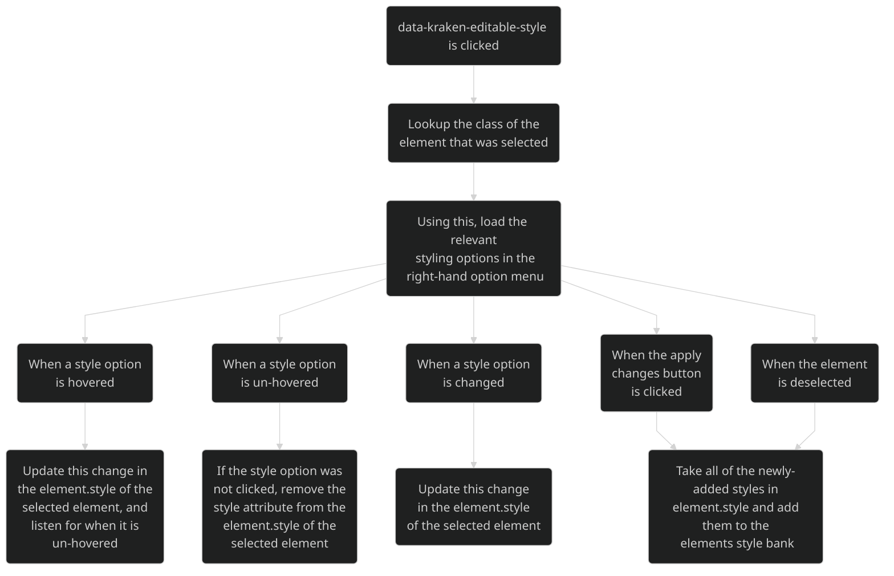

##### Displaying text editors
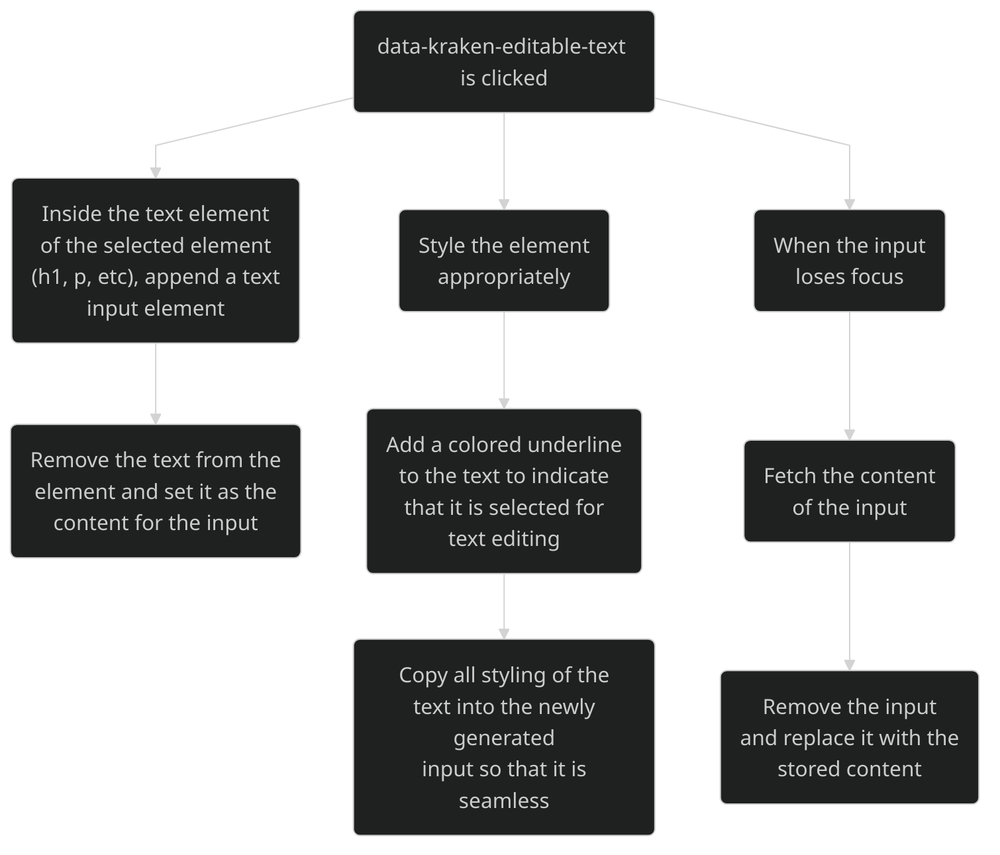

##### Multi-user system
The SQL and multi-user algorithms are all mostly handled by libraries that I am using, which means that I can use function calls such as `login_user(user)` from the `flask_login` library, or `user = self.User.query.filter_by(user_id=username).first()` that uses an inherited class in the `models.py` file to perform an SQL query. As such, the algorithms for the multi-user system are all based on input verification.

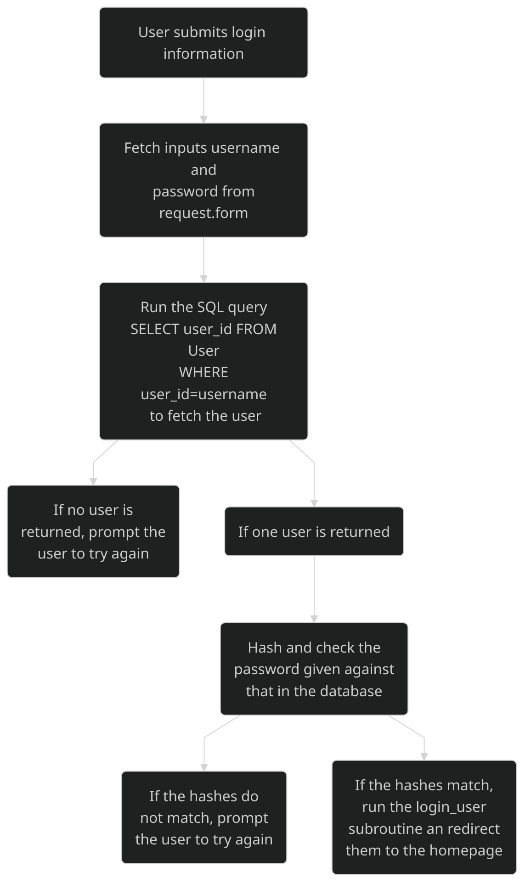

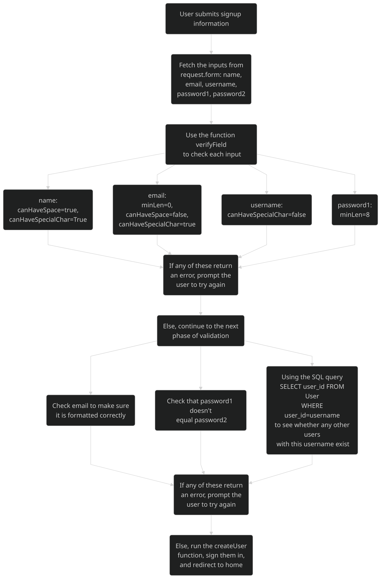

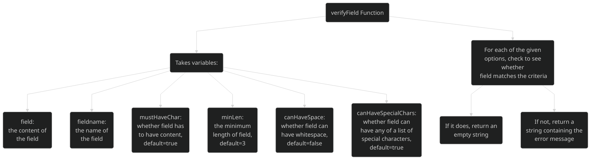

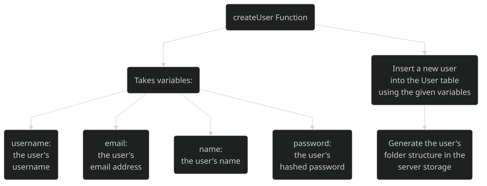


TODO: add the algorithms for creating the sites


#### Diagram showing how the subroutines link

<!--

MERMAID MINDMAP DOESNT WORK IN GITHUB MARKDOWN YET SO USE AN IMAGE INSTEAD

```mermaid
%%{init:{
  "theme": "base",
  "themeVariables": {
    "primaryColor": "#98c4e4",
    "secondaryColor": "#b3c3ff",
    "tertiaryColor": "#ccd7ff"
  }
}}

mindmap
  root((MAIN))

    (Editor Opened)
        (Check for user permissions)
            (If editor, run as normal)
            (If viewer, direct to the preview page)
            (If private, display an error screen)
        (Load files from server)
            (Necessary files will be listed in the siteDat json file)
            (HTML will be populated with kraken data attributes)
            (Apply all of the necessary CSS and JavaScript)
                (Use dedicated style and script tags, instead of importing them)

    (Action taken)
        (Store action in action log)
            (This can be accessed for undos, redos and saves)

    (Editor Saved)
        (If an element is selected, prompt to deselect to save)
        (Fetch HTML from editor)
            (Remove imported CSS and JavaScript from HTML block)
            (Remove any current selected tags)
            (Update any changed HTML files in the server storage)
        (Look at action log for any changes to imported files)
            (If changes, update sideDat json file as necessary)

    (Display settings changed)
        (If aspect ratio has been altered)
            (Append necessary data attributes to container element)
            (Resize container as necessary)
            (Update JavaScript displaysize variables)
                (So that it knows what CSS and HTML to update, if necessary, and which subroutines to call on event listeners)


    (Element Selected)
        (If locked, pass)
            (Display unlock button)
        (Check for attributes to determine functionality)
            (If styleable, populate style area with relevant options)
                (Listen for hovers and selects to add styling)
                (Listen for deselection of element to update styles)
            (If draggable, draw a bounding box)
                (Listen for click and hold)
            (If resizable, draw a bounding box with resize points)
                (Listen for click and hold)
        (Append necessary selected tags)

    (Section Selected)
        (If locked, pass)
            (Display unlock button)
        (Check for attributes to determine functionality)
            (If styleable, populate style area with relevant options)
                (Listen for hovers and selects to add styling)
                (Listen for deselection of element to update styles)
            (If draggable, listen for click and hold)
            (If resizable, listen for hover over bottom border)
                (Display a resize toggle and listen for click and hold)
            (Append necessary selected tags)
```

-->


### Subroutines
Now that I have a rough idea of what the subroutines will do and how they will fit together, I can start planning them in pseudocode. The multi-user subroutines will be written in python as that is what I am using for the backend, whereas the subroutines for the website builder will be written in JavaScript, and will be imported into the HTML.

TODO: Talk about how the JavaScript subroutines will be organised in the files.

#### Multi-user system - login system

##### auth_login_post
The flask backend will call this subroutine when the user submits the login form. Using the `flask` `request` import, the subroutine will be able to fetch the data inputted from the form. The password that it recieves will already have been hashed on the client's side so that it is being sent over the internet encrypted.

```python
@self.app.route("login",method=post)
def auth_login_post(): # run when the user submits the login form

  # fetch inputs from the form using the ids of the inputs
  username = flask.request.form.get("username")
  password = flask.request.form.get("password")
  remember = flask.request.form.get("remember")

  # fetch a list of users that match the username from the database
  user = db.query(f"SELECT * from USER where user_id={username}").fetchall()

  # if the list of users is empty
  # or the user's hashed password doesn't match the inputted hashed password
  if user.length = 0 || user[0].password == password:
    flash("Please check your login details and try again") # flash() passes a message to the next request (next page the user will see)
    return flask.redirect(flask.url_for("auth_login")) # redirect the user to the login page and ask them to try again

  flask.login_user(user,remember=remember) # login the user
  return flask.redirect(flask.url_for("main_home"))
```

##### auth_signup_post
The flask backend will call this subroutine when the user submits the signup form. It uses similar functionality to the `auth_login_post` function, including the passwords being hashed client-side. It uses the `verifyField` subroutine to check that fields are valid, along with the `createUser` subroutine to insert a new user into the database and add them to the server storage. Both subroutines are shown later.

```python
@self.app.route("signup",method=post)
def auth_signup_post(): # run when the user submits the signup form

  # fetch inputs from the form using the ids of the inputs
  name = flask.request.form.get("name")
  email = flask.request.form.get("email")
  username = flask.request.form.get("username")
  password1 = flask.request.form.get("password")
  password2 = flask.request.form.get("password-repeat")

  # Use the verifyField function to check the inputs are valid. It returns an empty string if valid, or an error message if not.
  out = verifyField(name,"Name",canHaveSpace=True,canHaveSpecialChar=True)

  if out.length > 0:
    flash([True,out,"",email,username])
    return flask.redirect(flask.url_for("auth_signup"))

  out = verifyField(email,"Email",minLen=0,canHaveSpace=False,canHaveSpecialChar=True)

  if out.length > 0:
    flash([True,out,name,"",username])
    return flask.redirect(flask.url_for("auth_signup"))

  # Check to see whether the email is in a valid format
  if not isEmailFormat(email):
    flash([True,"Email is not in a recognised format",name,"",username])
    return flask.redirect(flask.url_for("auth_signup"))

  # Run an SQL query to check whether this email already has an account
  user = db.query(f"SELECT * from USER where email={username}").fetchall()

  if user:
      flash([True,"That email is already in use",name,"",username])
      return flask.redirect(flask.url_for("auth_signup"))

  out = verifyField(username,"Username",canHaveSpecialChar=False)

  if out.length > 0:
    flash([True,out,name,email,""])
    return flask.redirect(flask.url_for("auth_signup"))

  out = verifyField(password1,"Password",minLen=8)

  if out.length > 0:
    flash([True,out,name,email,username])
    return flask.redirect(flask.url_for("auth_signup"))

  # Make sure the passwords match
  if password1 != password2:
    flash([True,"Passwords do not match",name,email,username])
    return flask.redirect(flask.url_for("auth_signup"))


  # run the createUser function to insert a user into the database
  createUser(username,email,name,password)

  # redirect to the home page
  return flask.redirect(flask.url_for("main_home"))
```

TODO: talk about how the flashes for the error messages work

##### verifyField
This subroutine will be called from `auth_signup_post` to make sure that all of the fields that the user inputted are valid. It takes four variables that are the requirements that the field has to meet, along with the content of the field, and the name of the field for any error messages. It will return an empty string if the field meets all of the requirements, and it will return an error message if it doesn't.

```python
def verifyField(field,fieldName,mustHaveChar=True,minLen=3,canHaveSpace=False,canHaveSpecialChar=True):
  # field, required, string, the content of the field
  # fieldName, required, string, the name of the field inputted
  # mustHaveChar, optional (default=true), boolean, whether or not field must contain characters
  # minLen, optional (default=3), integer, the mininmum length of field
  # canHaveSpace, optional (default=false), boolean, whether or not field can contain whitespace
  # canHaveSpecialChar, optional (default=true), boolean, whether or not field can contain any of a list of special characters

  specialChar = "%&{}\\<>*?/$!'\":@+`|=" # the list of special characters that canHaveSpecialChar refers to

  # Make sure that field is the correct datatype
  if field.type is not str:
    raise Exception(f"Invalid data type for field. Expected string, recieved {field.type}")

  # If field is empty and mustHaveChar is true
  if field.length == 0 and mustHaveChar:
    return f"{fieldName} is not filled out."

  # If field is shorter than minLen
  if field.length < minLen:
    return f"{fieldName} must be greater than {minLen-1} characters."

  # If field contains spaces and canHaveSpace is false
  if not canHaveSpace and " " in field:
    return f"{fieldName} cannot contain spaces."

  # If the field contains any of the specialChars and canHaveSpecialChar is false
  if not canHaveSpecialChar:
    for char in specialChar:
      if char in field:
        return f"{fieldName} cannot contain '{char}'"

  # Everything's good, return an empty string
  return ""
```

##### createUser
This subroutine will be called from `auth_signup_post` when it wants to add a new user to the system. It will, using the arguments given, insert a new user into the database, and generate the required folder structure for the user, using the subroutine `generateFolderStructure`. It is a procedure, and therefore will not return anything.

```python
def createUser(username,email,name,password):
  # generate the model for a new user
  newUser = self.User(
    user_id=username,
    name=name,
    email=email,
    password=password,
    bio="",
    url="",
    archived=False,
    tabpreference=4,
  )

  prefix="static/data/userData/" # the base path for where the folders should be created

  # using the os.path module, get the absolute paths of all of the reuqired folders
  folderStructure=[os.path.abspath(f"{prefix}{u}"),os.path.abspath(f"{prefix}{u}/sites/")]

  # create all the required folders
  generateFolderStructure(folderStructure)

  # using the generated model, commit it to the database
  db.session.add(newUser)
  db.session.commit()
```

#### Multi-user system - creating a new site
TODO: add the algorithms for creating the sites


#### Utility subroutines
These subroutines are called in different parts of the python files to do different, specific actions. This means that it removes duplicate code for procedures that may need to be used many times throughout

##### generateFolderStructure
This subroutine is called whenever the code needs to generate a list of folders. It makes use of the in-built `os` library in python. It is called when a new user is created, or when a user creates a new site.

```python
def generateFolderStructure(folders):
  for folder in folders: # iterate through the list of folders
    if os.path.isdir(folder): # if the folder already exists
      continue
    try:
      os.makedirs(folder)
    except OSError as e: # error catching if required
      raise OSError(e)
```

##### generateFileStructure
This subroutine is called whenever the code needs to generate a list of files. It makes use of the in-built `os` library in python. It is called  when a user creates a new site.

```python
def generateFileStructure(files):
  for file in files: # iterate through the list of files
    if os.path.exists(file): # if the file already exists
      continue
    try:
      with open(file,"w") as f: f.close() # write a new, empty file
    except OSError as e: # error catching if required
      raise OSError(e)
```


#### Birthday Invite Generator


### Features
To assemble the web pages, the clients will be able to drag and drop pre-designed elements categorised in groups such as headlines, quotes, forms, footers and more. The elements can be previewed in a sidebar next to the main canvas of the page, displayed with the correct styles of the website, from which they can be placed on the webpage. The website itself would be divided into sections, where you can drag and drop whole sections into the page or add individual elements into an existing section, such as text elements or images. After placing the elements into the canvas, the client can select the element to be able to interact with them, by moving them around, changing their styling (such as padding, size, coloring, transparency, position, font size, and many more) in a panel called the inspector panel, adding children to the element, or writing custom element-specific HTML, CSS, or JavaScript code that can be translated into the preview in real time. These custom elements / pieces of code will then be saved in the clients account, so that they can be used in other projects and/or published so that other clients can use them. The canvas will highlight elements with a border when they are hovered over, so that the client can easily see what the different elements are and how they can interact with them. The overall aim of the editor is for someone with very minimal knowledge, even none at all, about web design or programming to be able to interact with it, hence the WYSIWYG intuitiveness.

The canvas would have options at the top to be able to preview at certain conventional dimensions (375px for phones, 768px for tablets, etc) or at custom widths. This is so that the client can view how the elements interact with each other at custom resolutions. The elements, in the inspector panel, will also have options to change parameters at different screen resolutions (in the functionality of `@media screen and (max-width: 375px)`). There will also be an option to preview the site in its full functionality, where you can view all or the page without the extra clutter of the canvas and side panels.

The styling of the website will be able to be edited in a side panel, where the color scheme, element preferences and font face can be changed. There will be custom pre-selected pairings of colors and of fonts, but the user would also be able to use their own fonts, given they could provide a google fonts link or an otf/ttf file. The colors would be able to be changed using a color pricer and certain sliders. The website code itself (when rendering the colors) will reference variables defined at the top of the code, in the format --colors-<name>-[light|dark]-[rgb], such as --colors-secondary-dark. The light and dark variants will be generated by the website, but the main colors (primary, secondary, and accent) can be selected by the client. There will also be a light and dark color, and grey 100 through 900, generated by the code from user input of parameters of minimum darkness, maximum lightness and color temperature. All color variables will be stored in hex format, and there will be three-integer versions in rgb format. For font variables, there will be a body, header and jumbo font variable, where the jumbo font defaults to the header font unless specified otherwise by the client. There will also be a sans-serif and a serif font variables for use in defining the other variables, as each font will have a “backup” font if it cannot be imported. An example of the variable declaration would look like this:
```--colors-primary-light: #58a1ee;
--colors-primary: #1c7fe9;
--colors-primary-dark: #1263ba;
--colors-secondary-light: #dd51e1;
--colors-secondary: #a91dae;
--colors-secondary-dark: #88188c;
--colors-accent-light: #6acbf1;
--colors-accent: #27b3eb;
--colors-accent-dark: #118bbb;
--colors-light: #f8f9fa;
--colors-dark: #121212;
--colors-primary-light-rgb: 88, 161, 238;
--colors-primary-rgb: 28, 127, 233;
--colors-primary-dark-rgb: 18, 99, 186;
--colors-secondary-light-rgb: 221, 81, 225;
--colors-secondary-rgb: 169, 29, 174;
--colors-secondary-dark-rgb: 136, 24, 140;
--colors-accent-light-rgb: 106, 203, 241;
--colors-accent-rgb: 39, 179, 235;
--colors-accent-dark-rgb: 17, 139, 187;
--colors-light-rgb: 248, 249, 250;
--colors-dark-rgb: 18, 18, 18;
--colors-grey-100: #dee2e6;
--colors-grey-200: #ced4da;
--colors-grey-300: #adb5bd;
--colors-grey-400: #81888F;
--colors-grey-500: #8d959d;
--colors-grey-600: #495057;
--colors-grey-700: #343a40;
--colors-grey-800: #212529;
--colors-grey-900: #1f1f1f;
--font-sans-serif: "Helvetica", "Arial", sans-serif;
--font-serif: serif;
--font-body: "Roboto", var(--font-sans-serif);
--font-header: "Lexend", var(--font-sans-serif);
--font-jumbo: var(--font-header);
```

The clients designs will be stored on the server which can be recoverable and editable on any computer until the website is complete. The server will create regular backups of the site that can be recoverable in case the client wants to retrieve a previous version of the site. Websites can be downloadable by the client at any time in a structure that will allow them to host the website easily.

The client would be able to share the website to other clients, giving them viewing permissions (if the website is private), the ability to download the site, and potentially be able to edit the site. The client would also be able to transfer the ownership of the site to someone else.

To access the website builder, the URL functions like this: `/<username>/<sitename>/`, where the backend interprets the URL to send the correct information to the client as to be able to load the site. It will check for permissions for the client to send the appropriate site to them.
