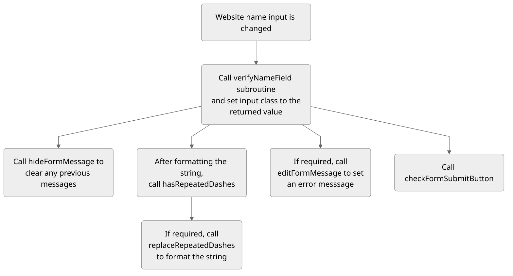
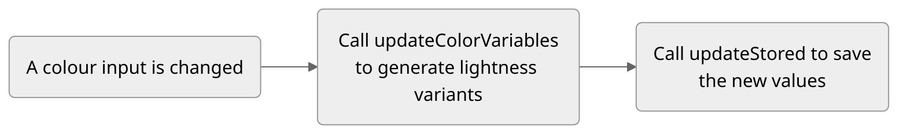

# REPORT.md

### Site URL navigation diagram

  ```mermaid
  %%{init: {'theme':'dark', 'flowchart': {'curve': 'linear'},'themeVariables':{'fontFamily':'Lexend,Noto Sans,Helvetica,Arial'}}}%%
  %%{init: {'theme':'neutral', 'flowchart': {'curve': 'linear'},'themeVariables':{'fontFamily':'Lexend,Noto Sans,Helvetica,Arial'}}}%%

  graph TB
      a((Root)) --> o(Login):::g
      a --> p(Signup):::g
      a --> b(Account):::o
      a --> j("&lt;username&gt;"):::g
      a --> q(Home):::o
      b --> c(Settings):::o
      b --> i(Logout):::o
      c --> d(Profile):::o
      c --> e(Admin):::o
      c --> f(Looks):::o
      c --> g(Sites):::o
      c --> h(Code):::o
      j --> v("&lt;sitename&gt;\n (public)"):::g
      j --> k("&lt;sitename&gt;\n (private)"):::r
      v --> l(Home):::g
      k --> w(Home):::r
      w --> m
      w --> n
      l --> m(Edit):::r
      l --> n(Settings):::r
      q --> r(New):::o --> s(1):::o
      r --> t(2):::o
      r --> u(Generate):::o
      classDef g fill:#060,color:#fff;
      classDef o fill:#950,color:#fff;
      classDef r fill:#800,color:#fff;
      %%classDef g fill:#030
      %%classDef o fill:#630
      %%classDef r fill:#600
  ```

### User-Class entitiy relationship diagram

  ```mermaid
  %%{init: {'theme':'dark', 'themeVariables':{'fontFamily':'Lexend,Noto Sans,Helvetica,Arial'}}}%%
  %%{init: {'theme':'neutral', 'themeVariables':{'fontFamily':'Lexend,Noto Sans,Helvetica,Arial'}}}%%

  erDiagram
      USER ||--o{ SITE : has
      USER {
          string user_id
          string name
          string email
          string password
          string bio
          string url
          bool archived
          int tabpreference
      }

      SITE {
          int site_id
          string user_id
          string name
          datetime datecreated
          bool private
          bool deleted
          text sitepath
      }
  ```

### User-Link-Class entitiy relationship diagram

  ```mermaid
  %%{init: {'theme':'dark', 'themeVariables':{'fontFamily':'Lexend,Noto Sans,Helvetica,Arial'}}}%%
  %%{init: {'theme':'neutral', 'themeVariables':{'fontFamily':'Lexend,Noto Sans,Helvetica,Arial'}}}%%

  erDiagram  

      USER ||--o{ LINK: has
      USER {
          string user_id
          string name
          string name
          string email
          string password
          string bio
          string url
          bool archived
          int tabpreference
      }

      LINK {
          string user_id
          int site_id
          string role
          bool canedit
          bool canview
      }

      SITE ||--o{ LINK: "to"
      SITE {
          int site_id
          string user_id
          string name
          datetime datecreated
          bool private
          bool deleted
          text sitepath
      }
  ```

### Server-side user data file storage structure diagram

  ```mermaid
  %%{init: {'theme':'dark', 'flowchart': {'curve': 'linear'},'themeVariables':{'fontFamily':'Lexend,Noto Sans,Helvetica,Arial'}}}%%
  %%{init: {'theme':'neutral', 'flowchart': {'curve': 'linear'},'themeVariables':{'fontFamily':'Lexend,Noto Sans,Helvetica,Arial'}}}%%

  graph TB
      a(userData) --> b("&lt;username&gt;") --> c(sites) --> d("&lt;sitename&gt;") --> e(files) & f(site.ini) & g(siteDat.json)
      e --> h(1.html) & i(2.html) & j(3.html)
  ```

### Resize box algorithm flowcharts
  ```mermaid
  %%{init: {'theme':'dark', 'flowchart': {'curve': 'linear'},'themeVariables':{'fontFamily':'Lexend,Noto Sans,Helvetica,Arial'}}}%%
  %%{init: {'theme':'neutral', 'flowchart': {'curve': 'linear'},'themeVariables':{'fontFamily':'Lexend,Noto Sans,Helvetica,Arial'}}}%%

  graph TD
    A(data-kraken-resizable is clicked) --> B(Render resize box) --> a("In the parent element of\n the selected element, add\n 12 elements with absolute\n positions") & C("For each corner,\n add event listers")
  ```
  ```mermaid
  %%{init: {'theme':'dark', 'flowchart': {'curve': 'linear'},'themeVariables':{'fontFamily':'Lexend,Noto Sans,Helvetica,Arial'}}}%%
  %%{init: {'theme':'neutral', 'flowchart': {'curve': 'linear'},'themeVariables':{'fontFamily':'Lexend,Noto Sans,Helvetica,Arial'}}}%%

  graph TD
    a("In the parent element of\n the selected element, add\n 12 elements with absolute\n positions") --> b("Using CSS, make four\n of them edges, and\n eight of them boxes") & c("Using JS, position them\n so that they create a\n bounding box around\n the element")
  ```
  ```mermaid
  %%{init: {'theme':'dark', 'flowchart': {'curve': 'linear'},'themeVariables':{'fontFamily':'Lexend,Noto Sans,Helvetica,Arial'}}}%%
  %%{init: {'theme':'neutral', 'flowchart': {'curve': 'linear'},'themeVariables':{'fontFamily':'Lexend,Noto Sans,Helvetica,Arial'}}}%%

  graph TD
    C("For each corner,\n add event listers") --> E("When resize box corner\nis clicked (and held)") --> F("Store cursor's current\n position to work out the\n new positioning values") & H("When the cursor's\n position changes") & K("When the cursor is released")
    F --> G("Add temporary width, height,\n and positioning attributes to\n the resize box elements\n and the element itself")
    H --> I("Update the size of the\n resize box elements so that\nit snaps to the grid box\n closest to the cursor") & J("Update the content of\n the element to match the\n resize box's new size")
    K --> L("Take the temporary variables\n and store them as the new\n width, height, and position\n for the element")
  ```

### Dragging and dropping elements algorithm flowchart
  ```mermaid
  %%{init: {'theme':'dark', 'flowchart': {'curve': 'linear'},'themeVariables':{'fontFamily':'Lexend,Noto Sans,Helvetica,Arial'}}}%%
  %%{init: {'theme':'neutral', 'flowchart': {'curve': 'linear'},'themeVariables':{'fontFamily':'Lexend,Noto Sans,Helvetica,Arial'}}}%%

  graph TD
    A(data-kraken-draggable is clicked) --> B(Render resize box) --> D("For each edge,\n add event listeners") --> M("When resize box edge\nis clicked (and held)") --> N("Store cursor's current\n position to work out the\n new positioning values") --> O("Add temporary positioning\n attributes (left right top and\n bottom) to the resize box\n elements and the element itself")
    M --> P("When the cursor's\n position changes") --> Q("Update the position of the\n resize box so that it snaps\n to the nearest grid box") & R("Update the position of\n the element so that it\n follows the cursor")
    M --> S("When the cursor is released") --> T("Set the element's position\n to the closest grid box to\n the cursor, and re-render\n the resize box to match")
  ```

### Dragging and dropping sections algorithm flowchart
  ```mermaid
  %%{init: {'theme':'dark', 'flowchart': {'curve': 'linear'},'themeVariables':{'fontFamily':'Lexend,Noto Sans,Helvetica,Arial'}}}%%
  %%{init: {'theme':'neutral', 'flowchart': {'curve': 'linear'},'themeVariables':{'fontFamily':'Lexend,Noto Sans,Helvetica,Arial'}}}%%

  graph TD
    A(data-kraken-section & data-kraken-draggable is clicked and held) --> B("Add drop shadow until\n dropped to make it clear\n that it's being moved") & C("Store cursor's current\n position to work out the\n new positioning values") & E("When the cursor's\n position changes") & G("When the cursor is released")
    B --> b("It could possibly also\n be scaled down a bit")
    C --> D("Add temporary positioning\n attributes (left right top and\n bottom) to the section")
    E --> F("Update the position of\n the section so that it\n follows the cursor")
    G --> H("Using the mouse\n positions that were\n recorded") --> I("Work out what the new\n order of the sections\n are and renumber them\n accordingly") & J("Restructure the HTML\n file so that the sections\n are in the new order")
    G --> K("Remove any temporary\n styling applied by the\n drag-and-drop feature")
  ```

### Displaying element and section options algorithm flowchart
  ```mermaid
  %%{init: {'theme':'dark', 'flowchart': {'curve': 'linear'},'themeVariables':{'fontFamily':'Lexend,Noto Sans,Helvetica,Arial'}}}%%
  %%{init: {'theme':'neutral', 'flowchart': {'curve': 'linear'},'themeVariables':{'fontFamily':'Lexend,Noto Sans,Helvetica,Arial'}}}%%

  graph TD
    A(data-kraken-editable-style is clicked) --> B("Lookup the class of the\n element that was selected") --> C("Using this, load the relevant\n styling options in the\n right-hand option menu") --> E("When a style option\n is hovered") & F("When a style option\n is un-hovered") & G("When a style option\n is changed") & I("When the element\n is deselected") & H("When the apply\n changes button\n is clicked")
    E --> e("Update this change in\n the element.style of the\n selected element, and\n listen for when it is\n un-hovered")
    F --> f("If the style option was\n not clicked, remove the\n style attribute from the\n element.style of the\n selected element")
    G --> g("Update this change\n in the element.style\n of the selected element")
    H & I--> J("Take all of the newly-added styles in\n element.style and add them to the\n elements style bank")
  ```

##### Displaying text editors
  ```mermaid
  %%{init: {'theme':'dark', 'flowchart': {'curve': 'linear'},'themeVariables':{'fontFamily':'Lexend,Noto Sans,Helvetica,Arial'}}}%%
  %%{init: {'theme':'neutral', 'flowchart': {'curve': 'linear'},'themeVariables':{'fontFamily':'Lexend,Noto Sans,Helvetica,Arial'}}}%%

  graph TD
    A(data-kraken-editable-text is clicked) --> B("Style the element\n appropriately") & E("Inside the text element\n of the selected element\n (h1, p, etc), append a text\n input element") & G("When the input\n loses focus")
    E --> F("Remove the text from the\n element and set it as the\n content for the input")
    B --> C("Add a coloured underline\n to the text to indicate\n that it is selected for\n text editing") --> D("Copy all styling of the\n text into the newly generated\n input so that it is seamless")
    G --> H("Fetch the content\n of the input") --> I("Remove the input\n and replace it with the\n stored content")
  ```

##### Login page
  ```mermaid
  %%{init: {'theme':'dark', 'flowchart': {'curve': 'linear'},'themeVariables':{'fontFamily':'Lexend,Noto Sans,Helvetica,Arial'}}}%%
  %%{init: {'theme':'neutral', 'flowchart': {'curve': 'linear'},'themeVariables':{'fontFamily':'Lexend,Noto Sans,Helvetica,Arial'}}}%%

  graph TD
    A(User submits login information) --> B("Fetch inputs username and\n password from request.form") --> C("Run the SQL query\n &quot;SELECT user_id FROM User\n WHERE user_id=username&quot;\n to fetch the user") --> D("If no user is\n returned, prompt the\n user to try again") & E("If one user is returned")
    E --> F("Hash and check the\n password given against\n that in the database") --> G("If the hashes do\n not match, prompt\n the user to try again") & H("If the hashes match,\n run the login_user\n subroutine and redirect\n them to the homepage")
  ```

##### Signup page
  ```mermaid
  %%{init: {'theme':'dark', 'flowchart': {'curve': 'linear'},'themeVariables':{'fontFamily':'Lexend,Noto Sans,Helvetica,Arial'}}}%%
  %%{init: {'theme':'neutral', 'flowchart': {'curve': 'linear'},'themeVariables':{'fontFamily':'Lexend,Noto Sans,Helvetica,Arial'}}}%%

  graph TD
    A(User submits signup information) --> B("Fetch the inputs from\n request.form: name,\n email, username,\n password1, password2") --> C("Use the function verifyField\n to check each input") --> D("name:\n canHaveSpace=true,\n canHaveSpecialChar=True") & E("email:\n minLen=0,\n canHaveSpace=false,\n canHaveSpecialChar=true") & F("username:\n canHaveSpecialChar=false") & G("password1:\n minLen=8") --> H("If any of these return\n an error, prompt the\n user to try again") --> h("Else, continue to the next\n phase of validation") --> I("Check email to make sure\n it is formatted correctly") & J("Check that password1 doesn't\n equal password2") & K("Using the SQL query\n &quot;SELECT user_id FROM User\n WHERE user_id=username&quot;\n to see whether any other users\n with this username exist") --> L("If any of these return\n an error, prompt the\n user to try again") --> M("Else, run the createUser\n function, sign them in,\n and redirect to home")
  ```

##### Field verification
  ```mermaid
  %%{init: {'theme':'dark', 'flowchart': {'curve': 'linear'},'themeVariables':{'fontFamily':'Lexend,Noto Sans,Helvetica,Arial'}}}%%
  %%{init: {'theme':'neutral', 'flowchart': {'curve': 'linear'},'themeVariables':{'fontFamily':'Lexend,Noto Sans,Helvetica,Arial'}}}%%

  graph TD
    A(verifyField Function) --> B("Takes variables:") --> a("field:\n the content\n of the field") & b("fieldname:\n the name \nof the field") & c("mustHaveChar:\n whether field\n has to have\n content,\n default=true") & d("minLen:\n the minimum\n length of\n field,\n default=3") & e("canHaveSpace:\n whether field\n can have\n whitespace,\n default=false") & f("canHaveSpecialChars:\n whether field can\n have any of a list of\n special characters,\n default=true")
    A --> C("For each of the\n given options,\n check to see\n whether field\n matches the\n criteria") --> D("If it does,\n return an\n empty string") & E("If not, return\n a string\n containing the\n error message")
  ```

##### Creating a new user
  ```mermaid
  %%{init: {'theme':'dark', 'flowchart': {'curve': 'linear'},'themeVariables':{'fontFamily':'Lexend,Noto Sans,Helvetica,Arial'}}}%%
  %%{init: {'theme':'neutral', 'flowchart': {'curve': 'linear'},'themeVariables':{'fontFamily':'Lexend,Noto Sans,Helvetica,Arial'}}}%%

  graph TD
    A(createUser Function) --> B("Takes variables:") --> a("username:\n the user's\n username") & b("email:\n the user's\n email address") & c("name:\n the user's name") & d("password:\n the user's\n hashed password")
    A --> C("Insert a new user\n into the User table\n using the given variables") --> D("Generate the user's\n folder structure in the\n server storage")
  ```

##### Creating a new site
  ```mermaid
  %%{init: {'theme':'dark', 'flowchart': {'curve': 'linear'},'themeVariables':{'fontFamily':'Lexend,Noto Sans,Helvetica,Arial'}}}%%
  %%{init: {'theme':'neutral', 'flowchart': {'curve': 'linear'},'themeVariables':{'fontFamily':'Lexend,Noto Sans,Helvetica,Arial'}}}%%

  graph TD
    A("User clicks on the\n create new site option") --> B("Redirect the user\n to the first site create\n page and take them through\n a set of options, seen below") & F("If the user tries to\n go to one of the option\n pages without doing them\n in chronological order,\n they will be redirected\n back to the first page")
    B --> C("When the user\n completes these\n options") & G("When the user completes \na page of options, they will\n be stored in flask.session.\n This means that the \nvariables can be carried over\n into the next page")
    C --> D("They will be\n redirected to the \nhomepage of the\n site") & E("The Flask backend will\n fetch the site settings\n from flask.session,\n and append them to a\n dictionary")
    E --> H("It will then call the\n createSiteStructure subroutine\n to create the site and add\n all of the siteSettings to it")
  ```

  ```mermaid
  %%{init: {'theme':'dark', 'flowchart': {'curve': 'linear'},'themeVariables':{'fontFamily':'Lexend,Noto Sans,Helvetica,Arial'}}}%%
  %%{init: {'theme':'neutral', 'flowchart': {'curve': 'linear'},'themeVariables':{'fontFamily':'Lexend,Noto Sans,Helvetica,Arial'}}}%%

  graph TD
    A("Option Page 1 - General Settings")
    A --> B("The option to import\n an exported site")
    A --> C("The name of the\n new website") --> c("The user will be\n told what the\n criteria are") --> d("If it meets the\n criteria, the input\n box will have a\n green border") & e("If it is too\n short, the input\n box will have a\n red border") & f("If it has any\n illegal characters,\n the input box will\n have an orange\n border")
    f --> g("The user will still be able\n to submit the form,\n but they will be shown\n what the site name will\n look like: any\n illegal characters will\n be replaced with dashes") & h("Illegal characters\n are any character\n that are not lowercase,\n alphanumeric, dashes,\n underscores or periods")
    A --> D("The description\n for the website\n (the user is shown\n that it is optional)") & E("Whether they want\n to set the website to\n public or private") & G("When all options are\n valid, the &quot;Create Site&quot;\n button will become\n clickable")
    E --> F("The user will be\n told that they can\n change this later")
  ```

  ```mermaid
  %%{init: {'theme':'dark', 'flowchart': {'curve': 'linear'},'themeVariables':{'fontFamily':'Lexend,Noto Sans,Helvetica,Arial'}}}%%
  %%{init: {'theme':'neutral', 'flowchart': {'curve': 'linear'},'themeVariables':{'fontFamily':'Lexend,Noto Sans,Helvetica,Arial'}}}%%

  graph TD
    A("Option Page 2 - Colour Scheme") --> C("Whether the user\n wants light or\n dark mode for\n their website") & D("What the light\n and dark bounds\n are (how dark\n should the darkest\n colour be, and\n vice versa)") & E("What the monochromatic\n colour temperature\n should be (using a slider)") & F("What the primary,\n secondary, and accent\n colours are (using\n colour pickers)") --> G("All of these options will affect a set of\n preview boxes showing what the different colours will be") --> H("When they are finished,\n the user can click continue\n to move to the next page")
  ```

  ```mermaid
  %%{init: {'theme':'dark', 'flowchart': {'curve': 'linear'},'themeVariables':{'fontFamily':'Lexend,Noto Sans,Helvetica,Arial'}}}%%
  %%{init: {'theme':'neutral', 'flowchart': {'curve': 'linear'},'themeVariables':{'fontFamily':'Lexend,Noto Sans,Helvetica,Arial'}}}%%

  graph TD
    A("Option Page 3 - Font Family") --> C("The user will be displayed a\n list of font groups") --> D("Each group will have a main,\n large font, and a smaller font\n (with the label paragraph text)") --> E("The font names will be\n displayed in their\n respective fonts") --> F("The user can click on a\n font pair to select it,\n and then click continue\n to finish")
  ```

### Diagram showing how all subroutines link

  ```mermaid
  %%{init:{
    "theme": "base",
    "themeVariables": {
      "primaryColor": "#98c4e4",
      "secondaryColor": "#b3c3ff",
      "tertiaryColor": "#ccd7ff"
    }
  }}

  mindmap
    root((MAIN))

      (Editor Opened)
          (Check for user permissions)
              (If editor, run as normal)
              (If viewer, direct to the preview page)
              (If private, display an error screen)
          (Load files from the server)
              (Necessary files will be listed in the siteDat JSON file)
              (HTML will be populated with kraken data attributes)
              (Apply all of the necessary CSS and JavaScript)
                  (Use dedicated style and script tags instead of importing them)

      (Action taken)
          (Store action in action log)
              (This can be accessed for undos, redos and saves)

      (Editor Saved)
          (If an element is selected, prompt to deselect to save)
          (Fetch HTML from the editor)
              (Remove imported CSS and JavaScript from HTML block)
              (Remove any current selected tags)
              (Update any changed HTML files in the server storage)
          (Look at the action log for any changes to imported files)
              (If changes, update sideDat JSON file as necessary)

      (Display settings changed)
          (If the aspect ratio has been altered)
              (Append necessary data attributes to container element)
              (Resize container as necessary)
              (Update JavaScript display size variables)
                  (So that it knows what CSS and HTML to update, if necessary, and which subroutines to call on event listeners)


      (Element Selected)
          (If locked, pass)
              (Display unlock button)
          (Check for attributes to determine functionality)
              (If styleable, populate the style area with relevant options)
                  (Listen for hovers and selects to add styling)
                  (Listen for deselection of the element to update styles)
              (If draggable, draw a bounding box)
                  (Listen for click and hold)
              (If resizable, draw a bounding box with resize points)
                  (Listen for click and hold)
          (Append necessary selected tags)

      (Section Selected)
          (If locked, pass)
              (Display unlock button)
          (Check for attributes to determine functionality)
              (If styleable, populate the style area with relevant options)
                  (Listen for hovers and selects to add styling)
                  (Listen for deselection of element to update styles)
              (If draggable, listen for click and hold)
              (If resizable, listen for hover over the bottom border)
                  (Display a resize toggle and listen for click and hold)
              (Append necessary selected tags)
  ```

  

### Diagram showing how the top level site creation system works



### Diagram showing how the color selection system works



### development database diagram

  ```mermaid
  %%{init: {'theme':'dark', 'themeVariables':{'fontFamily':'Lexend,Noto Sans,Helvetica,Arial'}}}%%
  %%{init: {'theme':'neutral', 'themeVariables':{'fontFamily':'Lexend,Noto Sans,Helvetica,Arial'}}}%%

  erDiagram
      USER ||--o{ SITE : has
      USER {
          string user_id
          string name
          string email
          string password
          string bio
          string url
          bool archived
          int tabpreference
      }

      SITE {
          int site_id
          string user_id
          string name
          datetime datecreated
          bool private
          bool deleted
          text sitepath
      }
  ```

# CODE.md

### Server-side File Structure Diagram

  ```mermaid
  %%{init: {'theme':'neutral', 'flowchart': {'curve': 'linear'},'themeVariables':{'fontFamily':'Lexend,Noto Sans,Helvetica,Arial'}}}%%

  graph LR
    A((Root)) --> F(Static) & G(templates)
    A --> B(__init__.py):::file
    A --> C(db.sqlite):::file
    A --> D(dbCommands.txt):::file
    A --> E(models.py):::file
    F --> H(css) & I(data) & J(html) & K(img) & L(js)
    I --> M(defaultIcons) & N(userData)
    M --> O(default-1.png):::file

    N(userData) --> b("&lt;username&gt;") --> c(sites) --> d("&lt;sitename&gt;") --> e(files)
    d -->f(site.ini):::file
    d --> g(siteDat.json):::file
    e --> h(1.html):::file
    e --> i(2.html):::file
    e --> j(3.html):::file

    K --> m(icon) & n(stock)
    K --> o(error_1.png):::file
    K --> p(kraken_tentacles_1.png):::file
    m --> 1(64x64) & 2(128x128) & 3(256x256) & 4(512x512) & 5(svg)

    J --> q(sections) --> r("&lt;template&gt;")
    r --> s("html_element_&lt;template&gt;_&lt;i&gt;"):::file
    r --> 6(css.css):::file
    r --> 7(files):::file
    q --> 8(classes):::file

    classDef file fill:#ccc
  ```
